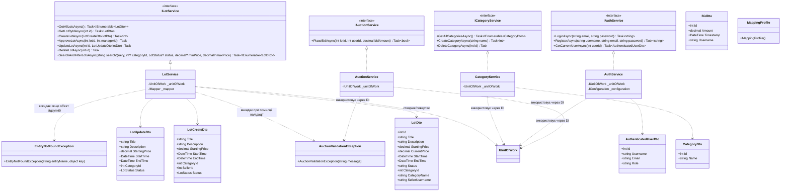

```mermaid
classDiagram
    direction TB

    %% Інтерфейси сервісів BLL
    class ILotService {
        <<interface>>
        +GetAllLotsAsync() Task~IEnumerable~LotDto~~
        +GetLotByIdAsync(int id) Task~LotDto~
        +CreateLotAsync(LotCreateDto lotDto) Task~int~
        +ApproveLotAsync(int lotId, int managerId) Task
        +UpdateLotAsync(int id, LotUpdateDto lotDto) Task
        +DeleteLotAsync(int id) Task
        +SearchAndFilterLotsAsync(string searchQuery, int? categoryId, LotStatus? status, decimal? minPrice, decimal? maxPrice) Task~IEnumerable~LotDto~~
    }

    class ICategoryService {
        <<interface>>
        +GetAllCategoriesAsync() Task~IEnumerable~CategoryDto~~
        +CreateCategoryAsync(string name) Task~int~
        +DeleteCategoryAsync(int id) Task
    }

    class IAuthService {
        <<interface>>
        +LoginAsync(string email, string password) Task~string~
        +RegisterAsync(string username, string email, string password) Task~string~
        +GetCurrentUserAsync(int userId) Task~AuthenticatedUserDto~
    }

    class IAuctionService {
        <<interface>>
        +PlaceBidAsync(int lotId, int userId, decimal bidAmount) Task~bool~
    }

    %% Реалізації сервісів
    class LotService {
        -IUnitOfWork _unitOfWork
        -IMapper _mapper
    }

    class CategoryService {
        -IUnitOfWork _unitOfWork
    }

    class AuthService {
        -IUnitOfWork _unitOfWork
        -IConfiguration _configuration
    }

    class AuctionService {
        -IUnitOfWork _unitOfWork
    }

    %% Об'єкти передачі даних (DTOs)
    class LotDto {
        +int Id
        +string Title
        +string Description
        +decimal StartingPrice
        +decimal CurrentPrice
        +DateTime StartTime
        +DateTime EndTime
        +string Status
        +int CategoryId
        +string CategoryName
        +string SellerUsername
    }

    class LotCreateDto {
        +string Title
        +string Description
        +decimal StartingPrice
        +DateTime StartTime
        +DateTime EndTime
        +int CategoryId
        +int SellerId
        +LotStatus Status
    }

    class LotUpdateDto {
        +string Title
        +string Description
        +decimal StartingPrice
        +DateTime StartTime
        +DateTime EndTime
        +int CategoryId
        +LotStatus Status
    }

    class CategoryDto {
        +int Id
        +string Name
    }

    class BidDto {
        +int Id
        +decimal Amount
        +DateTime Timestamp
        +string Username
    }

    class AuthenticatedUserDto {
        +int Id
        +string Username
        +string Email
        +string Role
    }

    %% Кастомні виключення (Exceptions)
    class AuctionValidationException {
        +AuctionValidationException(string message)
    }
    class EntityNotFoundException {
        +EntityNotFoundException(string entityName, object key)
    }

    %% Конфігурація Маппінгу
    class MappingProfile {
        +MappingProfile()
    }

    %% Зв'язки
    ILotService <|.. LotService
    ICategoryService <|.. CategoryService
    IAuthService <|.. AuthService
    IAuctionService <|.. AuctionService

    %% Залежності від DAL
    LotService ..> IUnitOfWork : використовує через DI
    CategoryService ..> IUnitOfWork : використовує через DI
    AuthService ..> IUnitOfWork : використовує через DI
    AuctionService ..> IUnitOfWork : використовує через DI

    %% Робота з DTO та виключеннями
    LotService ..> LotDto : створює/повертає
    LotService ..> LotCreateDto
    LotService ..> LotUpdateDto
    LotService ..> AuctionValidationException : викидає при помилці валідації
    LotService ..> EntityNotFoundException : викидає якщо об'єкт відсутній
    CategoryService ..> CategoryDto
    AuthService ..> AuthenticatedUserDto
    AuctionService ..> AuctionValidationException
```